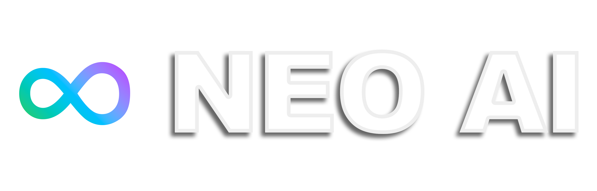

# NeoAI - A Revolutionary AI Assistant: Zero-Code, Intelligent Control of Your Computer!

## [🇨🇳 中文文档点我！](docs/README(zh-CN).md)

## [📖 Web Documentation](https://thed0ublec.github.io/NeoAI)

  

  
  
  

  
  
  

---

### 🌍 Language Support

#### 🎭 Extended Character Language Support

---

# ⭐ Live Demonstration

| Demo Image                 | Feature Description                                                   | Device                        |
| -------------------------- | ------------------------------------------------------------------- | ----------------------------- |
|  | Use your vague memory to search for specific files.                  | PC [Windows]                  |
|  | Enjoy a unique daily surprise! It could be cyber fraud or something lurking on your computer... | PC [Windows]                  |
|  | Monitor system status and check resource usage.                      | Mobile [iOS] + PC [Linux]     |

---

## 🚀 Let's Get Started with NeoAI

### **🔹 Install NeoAI**

👉 [📥 Install NeoAI Now](https://thed0ublec.github.io/NeoAI/#/en/installation)

> **⚠️ NeoAI is currently in the testing phase. You may encounter some issues—feedback is welcome!**

### **🔹 System Requirements**

- **Operating System**: Windows / macOS / Linux
- **Required API / Local Model (Choose One, Must Follow OpenAI API Format)**:
  - **Cloud Mode**: Requires an OpenAI API Key (GPT-4o recommended)
  - **Local Mode**: Must use a **local model server that supports OpenAI API format** and is accessible via `/v1/chat/completions`, such as:
    - **LM Studio** (API server mode must be enabled)
    - **Ollama** (Supports OpenAI API format by default)
    - **Other OpenAI API-compatible local LLM servers**
- **Runtime Version**: Python 3.8+

---

