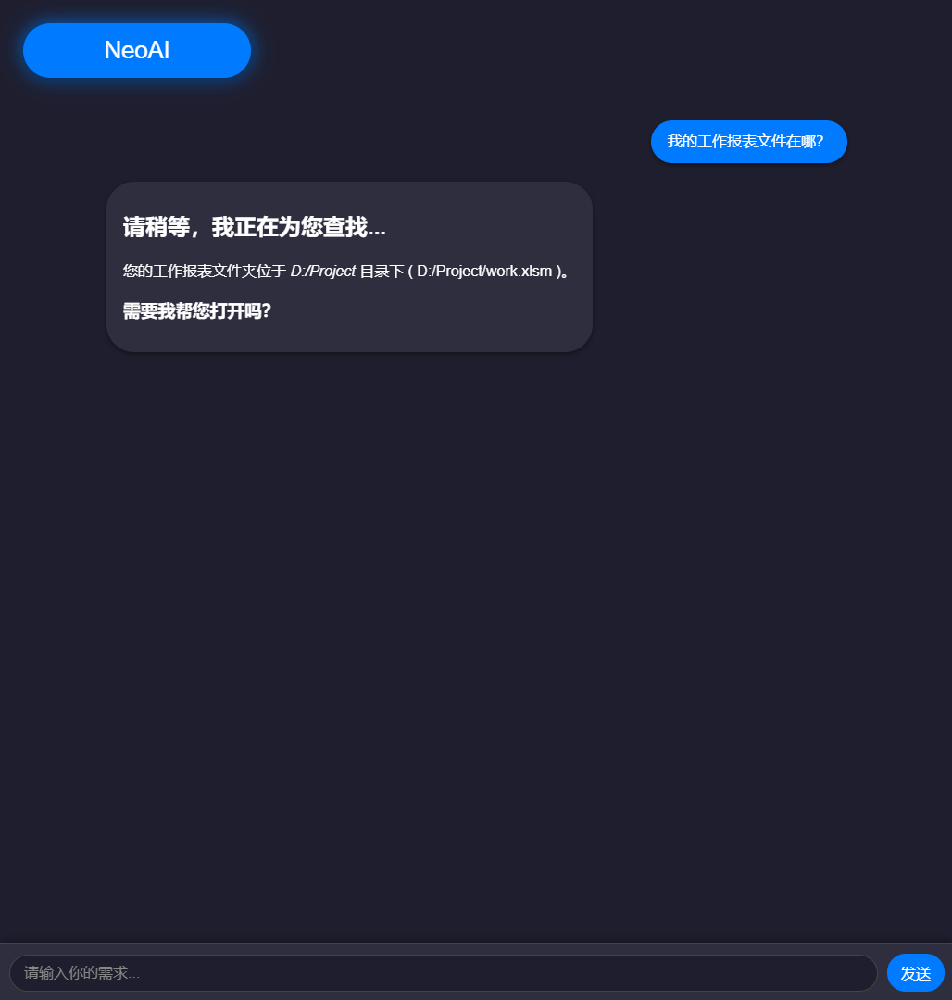
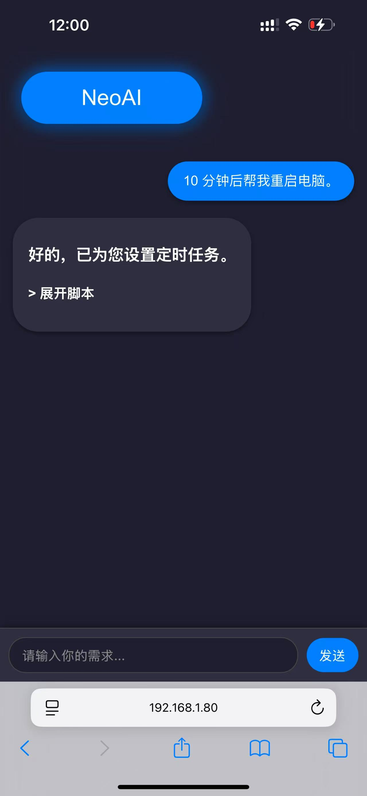

# **NeoAI：无需一行代码！让AI控制你的电脑！**
## **NeoAI 实现了微软吹过的牛！**

### **在您的电脑上**  
- **“我的工作报表文件在哪？”**  
  **“您的工作报表文件位于 D 盘的 Project 文件夹，需要我帮您打开吗？”**

---

### **在您的手机上**  
- **“10 分钟后帮我重启电脑。”**  
  **“好的，已为您添加定时执行。”**
  

---

### **随时随地掌控一切**  
NeoAI 支持在任何有浏览器的设备上远程控制您的电脑。

---

**NeoAI** 是一款专为开发者和高级用户设计的开源 AI 工具，能够通过自然语言直接控制操作系统，执行开发相关任务并大幅提升工作效率。  
它不仅仅是一个聊天助手，**更是一个能与系统深度交互的强大工具**。

