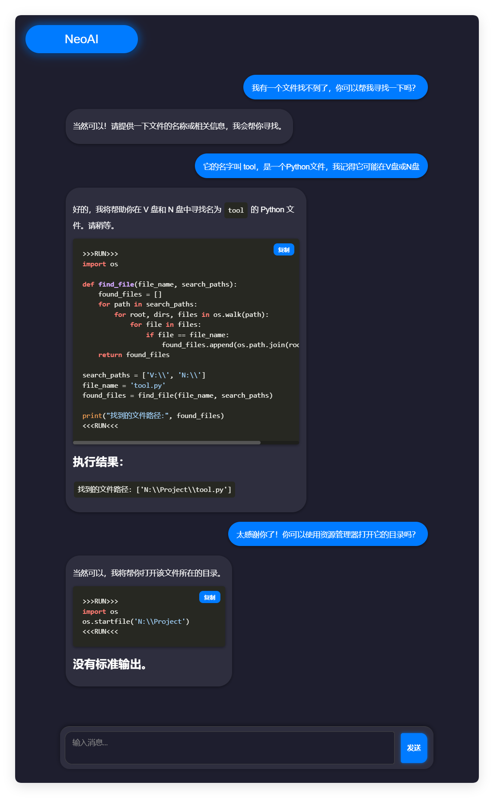
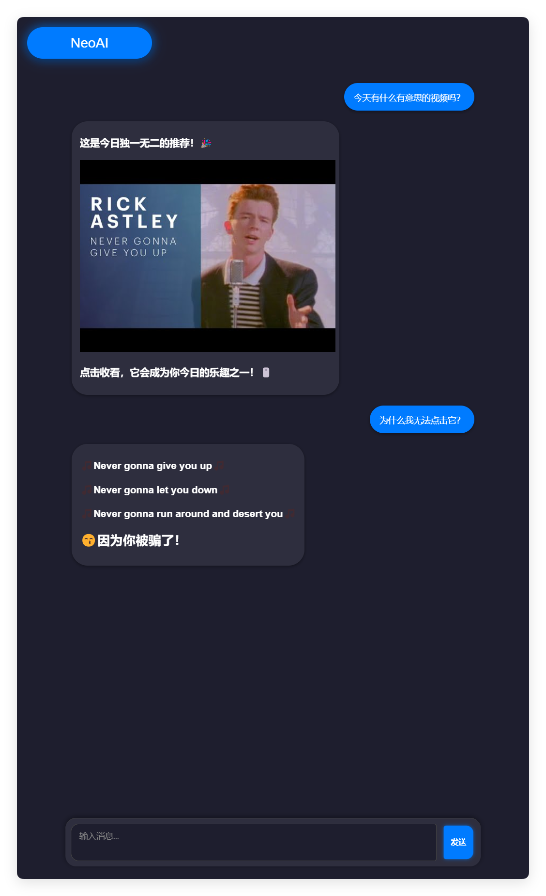
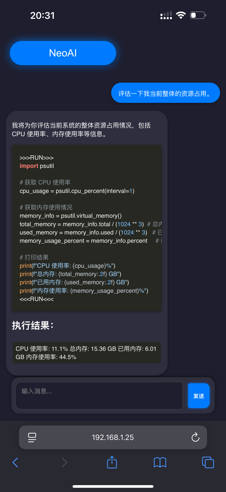

# NeoAI - 跨时代的 AI 助手：零代码，智能操控您的电脑！

## [📖 网页文档](https://thed0ublec.github.io/NeoAI)

  

  
  
  

  
  
  

---

### 🌍 语言支持

#### 🎭 扩展人设语言

---

# ⭐ 实机演示

| 演示图                  | 功能                                                                  | 设备                         |
| ----------------------- | --------------------------------------------------------------------- | ---------------------------- |
|  | 使用你的模糊记忆寻找指定文件。                                        | PC 端 [Windows]              |
|  | 提供每日独一份的乐趣！可能是赛博诈骗，也可能会在你电脑的某个角落里... | PC 端 [Windows]              |
|  | 监测系统状态，查看资源占用。                                          | 移动端 [iOS] + PC 端 [Linux] |

---

## 🚀 让我们开始使用 NeoAI

### **🔹 安装 NeoAI**

👉 [📥 立即安装 NeoAI](https://thed0ublec.github.io/NeoAI/#/zh-CN/installation)

> **⚠️ 目前 NeoAI 处于测试阶段，可能会遇到一些问题，欢迎反馈！**

### **🔹 运行环境要求**

- **操作系统**: Windows / macOS / Linux
- **必需 API / 本地模型（二选一，需符合 OpenAI API 格式）**:
  - **云端模式**：需要 OpenAI API Key（推荐使用 GPT-4o）
  - **本地模式**：必须使用 **支持 OpenAI API 兼容格式** 的本地模型服务器，确保可访问 `/v1/chat/completions`，如：
    - **LM Studio**（需开启 API 服务器模式）
    - **Ollama**（默认支持 OpenAI API 格式）
    - **其他 OpenAI API 兼容本地 LLM 服务器**
- **运行时版本**: Python 3.8+

---
