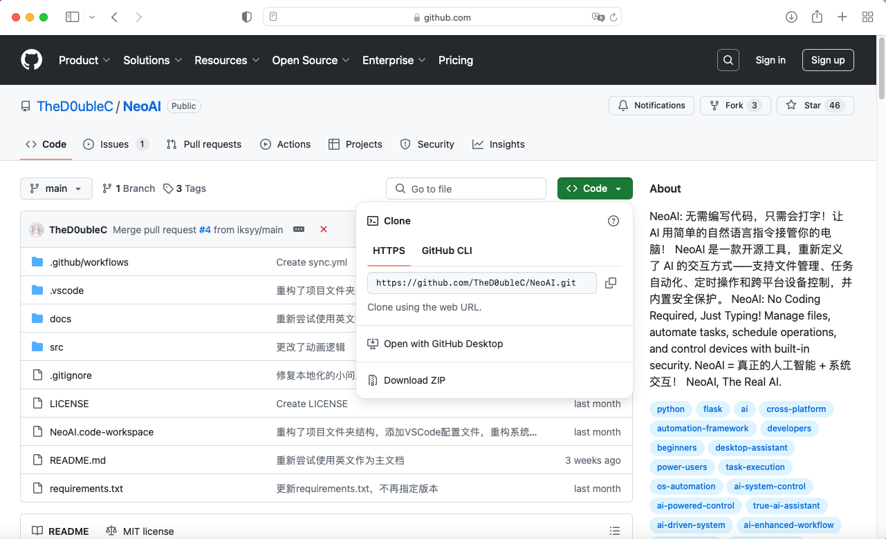

# 安装/部署

---

## 1. 获取项目

### **_克隆_** 本项目或 **_直接下载_** 本项目

- #### 直接下载

进入我们的仓库[NeoAI](https://github.com/TheD0ubleC/NeoAI)



- 1. 点击`Code`
- 2. 点击`Download ZIP`

---

- #### 克隆项目

```bash
git clone https://github.com/TheD0ubleC/NeoAI.git
```

#### 如果 **_克隆成功_**，将显示类似以下输出：

```text
Cloning into 'NeoAI'...
remote: Enumerating objects: XX, done.
remote: Counting objects: 100% (XX/XX), done.
remote: Compressing objects: 100% (XX/XX), done.
remote: Total XX (delta XX), reused XX (delta XX), pack-reused XX
Receiving objects: 100% (XX/XX), XX MiB | XX KiB/s, done.
Resolving deltas: 100% (XX/XX), done.
```

> 其中，`XX` 代表数字或文件的数量，`MiB` 和 `KiB/s` 表示下载的速度和大小。看到 **"done"** 表示克隆成功。

#### 克隆成功后直接跳至 [开始部署](#开始部署)。

#### 如果 **_克隆失败_**，将显示类似以下输出：

---

### 常见问题及解决方法

#### 网络连接问题

```text
fatal: unable to access 'https://github.com/TheD0ubleC/NeoAI.git': Could not resolve host: github.com
```

**解决方法**：

- 如果您位于中国大陆，可以使用 VPN 或其他工具访问 GitHub。
- 检查 DNS 设置，确保能正确解析 `github.com`。

---

#### 权限问题

```text
fatal: repository 'https://github.com/TheD0ubleC/NeoAI.git/' not found
```

**解决方法**：

- 确保仓库地址正确。如果是私有仓库，请检查访问权限。
- 如果使用 HTTPS 克隆，请确保 GitHub 账号配置了正确的用户名和密码。
- 推荐使用 SSH 克隆：

  1. 在 GitHub 中添加 SSH 密钥。
  2. 使用以下命令克隆：

  ```bash
  git clone git@github.com:TheD0ubleC/NeoAI.git
  ```

---

#### 存储空间不足

```text
fatal: unable to create file 'filename': No space left on device
```

**解决方法**：

- 检查本地磁盘空间，确保有足够存储空间来克隆仓库。
- 清理磁盘中的临时文件或不必要文件释放空间。

---

#### 代理设置问题

```text
fatal: unable to access 'https://github.com/TheD0ubleC/NeoAI.git': The requested URL returned error: 403
```

**解决方法**：

- 如果使用了代理，请检查代理设置是否正确，或临时关闭代理后再尝试。
- 如果代理设置不正确，可通过以下命令重置 Git 的代理配置：

  ```bash
  git config --global --unset http.proxy
  git config --global --unset https.proxy
  ```

---

## 2. 开始部署

### 进入项目目录

```bash
cd NeoAI
```

### 安装依赖

```bash
pip install -r requirements.txt
```

---

## 3. 选择运行方式

### WebUI

- **优点**：
  - 提供图形化界面，操作简单。
  - 支持远程访问。
  - 配置方便，交互友好。

#### 启动命令：

```bash
python src/web-ui.py
```

---

### 终端

- **优点**：
  - 适合无桌面环境。
  - 占用资源较少。

#### 启动命令：

```bash
python src/main.py
```

---

## 下一步我们将开始配置 NeoAI 接下来让我们前往

# [>配置教程](/zh-CN/tutorial.md)
